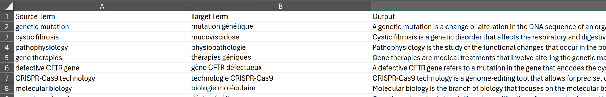

# OpenAI TermExtract

This repository contains a number of VB scripts for Excel that use OpenAI to take an export from Trados Studio (or any tool that supports extracting a bilingual translation to Excel) and then extracts the terminology and provides a definition of the terms. This information is saved in Excel in a format suitable for conversion to a termbase or glossary, or some intermediate format such as TBX by using the Glossary Converter from the Trados AppStore.

## Scripts

There are three scripts.

### JsonConverter.bas

Taken as-is from the code provided for a tool developed by Tim Hall called [VBA-JSON](https://github.com/VBA-tools/VBA-JSON) which is used for JSON conversion and parsing for VBA (Windows and Mac Excel, Access, and other Office applications). 

It was originally tested by Tim in Windows Excel 2013 and Excel for Mac 2011, but should apply to 2007+. I have used the JasonConverter.bas in Excel as part of Office 365 without any changes at all.

This is used within the CallOpenAI script to parse the JSON responses received from OpenAI's API, converting them into VBA objects that can be easily accessed and manipulated within Excel. This functionality is critical for extracting the AI-generated text responses needed for the TermExtraction script, which processes terms from a worksheet, sends them to the OpenAI API using the CallOpenAI function, and then inserts the responses back into the Excel workbook, replacing the API call formulas with their resulting values. 

### CallOpenAI.bas

I took the idea for this from an article written by Ed Twomey called [How to Integrate GPT-4 into Excel](https://medium.com/@ed.twomey1/how-to-integrate-gpt-4-into-excel-23954e4d60a6). I have extensively changed this for my needs but the original explanation of how to get OpenAI working in Excel came from this article.

The changes I made were to:

- read the API key from a cell in Excel
- read the model from a dropdown in Excel (GPT-4 or GPT-4o)
- read the prompt from a cell in Excel
- corrected some issues with the content sent to OpenAI having unescaped quotes
- added simple error handling 

### TermExtraction.bas

This script just brings things together and takes the output of the OpenAI calls, putting the content into a new worksheet where it is formatted quite simply as source term, target term, definition of the term.

This script does the following:

- sends the source and target content in Excel to OpenAI and extracts a list of source and matching target terms for each row (prompt is in an Excel worksheet for this)
- creates a new worksheet and adds the term pairs into separate columns
- sends the source terms to OpenAI and requests a definition for each one
- it also replaces the formula used with the plain text result to ensure any editing in the excel afterwards won't kick-off anymore calls to OpenAI

## Excel

I also attached the Excel I used for this (Term_Extraction_process.xlsm) to clarify how I did this. It contains three worksheets:

### Terms

I use this sheet to copy the bilingual content exported from Trados Studio using the [Export to Excel plugin](https://appstore.rws.com/Plugin/27 "Export to Excel") on the AppStore. It also contains a button that will run the macro to trigger the term extraction process.

### Prompts

I use this worksheet for the prompts I'm using. I hardcoded these locations into the scripts as I was building this as I intended this Excel feature to do one thing only. The script uses the Excel formulae I created like this for example:

=CallOpenAI_prompt(A1 & "~" & B1, Prompts!$A$3)

This formula calls the "CallOpenAI" function and sends the information between the brackets to OpenAI. Here's how this works:

*A1: location of the source text in the "Terms" worksheet*

*B1: location of the target text in the "Terms" worksheet*

A1 and B1 are concatenated with a tilde character between them.

*Prompts!$A$3 : the location of the prompt*

The prompts themselves can be edited in the Excel worksheet.

#### Getting the Terms

The prompt I used as default is this.  It could be refined considerably but I did find with some basic tests it did do a reasonable job:

"*You are an expert in terminology. Extract source and target terms from the text. The source and target sentences are seperated by a ~ symbol. The source and target terms should be paired and seperated by a pipe symbol, and each pair of terms should be seperated by a line feed.*"

#### Getting the Definition

The example I played with was life science related so I used a very simple prompt for this too, and only in English: 

*"You are a life science subject matter expert.  Provide a short and precise definition of the English term only."*

### Key_models

This worksheet holds the API Key, a drop down for the Model (currently gpt-4 or gpt-4o only):

The example call does nothing, I just added it to remind me of the syntax.

### Definitions

The "Definition" worksheet is created when the process is run:  

It contains the source term, target term, and a definition based on the source term.

## Installation and Pre-Requisites

### Installation

Either download the Excel from this site, in which case you will also have to resolve the security warnings you will get because your computer is going to ensure you are safe from harmful macro-enabled files downloaded from an unknown source, or, create your Excel based on what you have read here.

Once you have the various worksheets set up, add the prompts to the Prompts worksheet:

- Prompts!$A$3
- Prompts!$B$3

Then  the following to the Key_models worksheet:

- API Key: E3
- Models: E4

Finally download and import the VB scripts (*.bas) to your Excel file:

1. Download the three `.bas` files from GitHub by navigating to the file, clicking "Raw", and saving the file.
2. Open Excel and the VBA Editor (Alt + F11).
3. Import the `.bas` files in the VBA Editor via `File > Import File...`.
4. Save the Excel workbook as a macro-enabled workbook (`*.xlsm`).

### Pre-Requisites

You will also need to make a couple of changes to your settings in Excel.

- Enable the Developer tab in Excel. Go to `File -> Options -> Customize Ribbon` and check the `Developer` option.
- On the Developer tab, click on Visual Basic (which opens the Macros panel). Go to `Tools -> References` and enable “Microsoft XML, v6.0” (or a similar version) and “Microsoft Scripting Runtime.”
- Also choose the security options you feel most comfortable with running an Excel macro.

### Run the Tool

I added a button and assigned the macro to it, but you don't need to do this.  You could just run the tool by pressing `Alt+F8` and then selecting and running "ProcessTermsAndCopySplitTerms" from the list of macros.